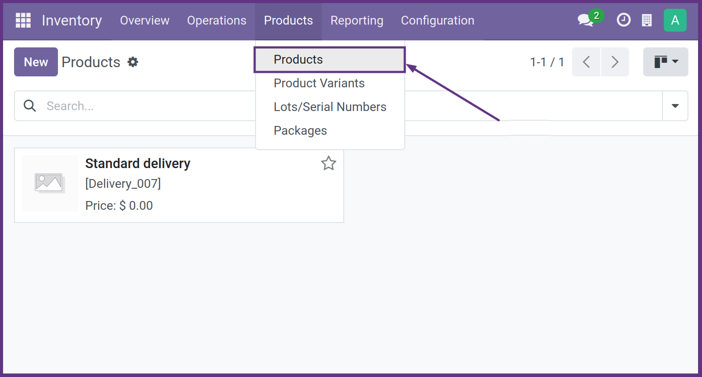
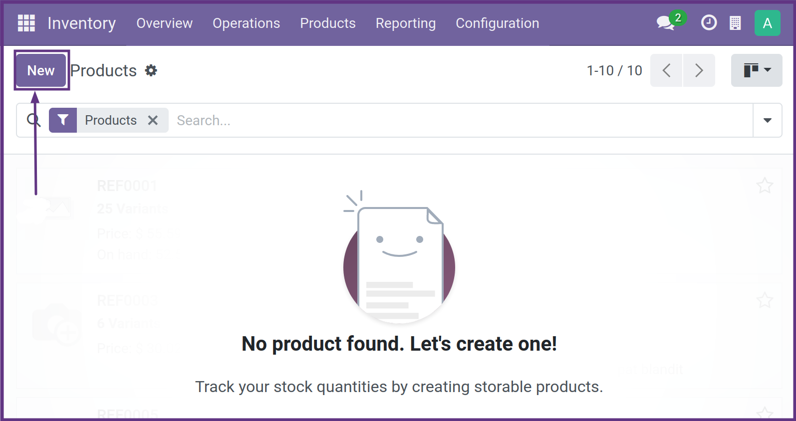
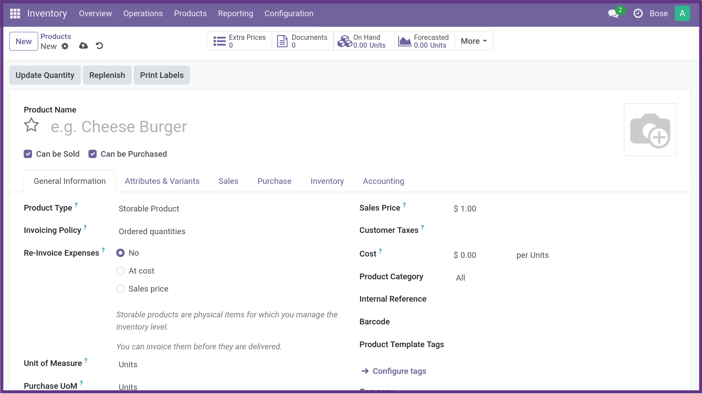

    Creación de Producto 

Once you have installed your Odoo Inventory, either yourself or with the help of a partner like Wait More, the first task is to create a product.
To do that, go to Products → Products → Create

 
 
Here is a basic step by step to create a product in Odoo:

- ### **1. Login to your Odoo instance**: 
   Access your Odoo instance using your user credentials.

- ### **2. Access the Inventory Module**:
    Once you have logged in, go to the Inventory module. You can find it in the main menu or by using the search bar.

- ### **3. Select the Products option**: 

   In the Inventory module, search and select the "Products" or "Products / Products" option. This option will take you to the list of existing products in your database.

  

  

     

- ### **4. Create a New Product**: 
   Once in the list of products, search and select the option to "Create" a new product. This option is usually located at the top or somewhere visible on the page.

     

- ### **5. Complete the Product Information**:
    * **Product Name**: Enter the name of the product you are creating.
    * **Product Category**: Select the category to which the product belongs. You can create new categories if necessary.
    * **Unit of Measurement**: Specifies the unit of measurement in which the product is sold (for example, units, kilograms, liters, etc.).
    * **Selling Price**: Enter the price at which you plan to sell the product.
    * **Purchase Cost**: Enter the purchase cost of the product if applicable.
    * **Taxes**: Add any taxes applicable to the product.
    * **Product Description**: Provides a brief description of the product.
 

     

- ### **6. Save the Product**: 
   Once you have completed the required information, save the product. You may find a "Save" button at the top or bottom of the page, depending on the configuration of your Odoo instance.

- ### **7. Check and Adjust Additional Settings (Optional)**:
    * **Inventory**: If necessary, set the product to track in inventory.
    * **Sales**: Adjust any settings related to the sale of the product, such as minimum order quantities, quantity pricing, etc.
    * **Purchasing**: If you plan to purchase this product, be sure to set up suppliers and purchasing prices.
    * **Other Tabs**: Explore other tabs and options as needed to further customize product settings.

- ### **8. Verify and List the Product**: 
   Before finishing, review all product information to make sure it is accurate. Once you are satisfied, publish the product to make it available for use.
   
<button id="printButton">PRINT PDF   </button>
