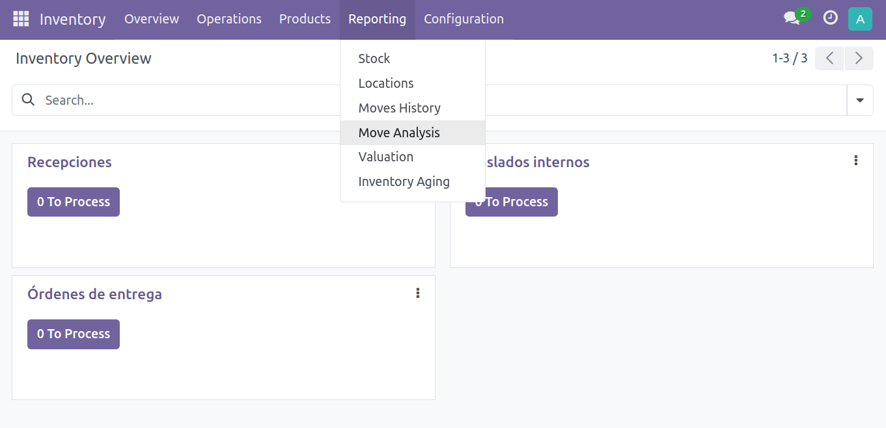
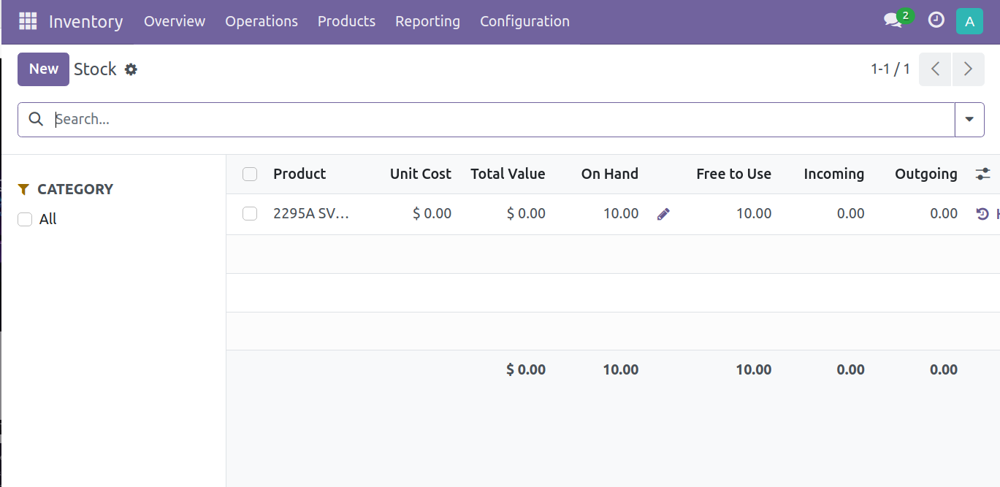

 

 
 
 

### See the stock in Odoo:

1. **Login**: The basic user must log in to their Odoo account using their username and password.

2. **Access the Inventory Application**: Once logged in, the user must go to the "Inventory" application. This can be done by selecting the appropriate option in the main menu or by using the search bar to find the application.

3. **View Stock**: Once inside the Inventory application, the basic user will be able to see the stock available in the company. This is usually displayed in list form or in a grid view, detailing available products along with their quantity in stock.

     

4. **Filter and Search Products (Optional)**: If the user wants to search for a specific product or filter the products by category or other characteristics, they can use the filter and search options available in the user interface.

5. **View Product Details**: By clicking on a specific product in the inventory list, the basic user can access more specific details about that product, such as stock location, minimum/maximum quantity, recent transactions, etc.

     

6. **Perform Stock-Related Actions (Optional)**: Depending on the permissions granted to the user, you can also perform stock-related actions, such as inventory adjustments, transfers between locations, physical counts, etc. These actions are usually available through buttons or drop-down menus in the user interface.
