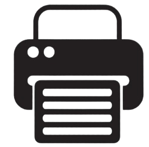

    Verification Guide for Product Forecasting in Odoo: 

### 1. **Product Configuration:**
- Make sure all the products you want to forecast are correctly configured in Odoo. This includes information such as product category, units of measure, costs, prices, etc.

### 2. **Warehouse configuration:**
- Verify that warehouses are configured correctly in Odoo, with the proper location and necessary inventory settings.

### 3. **Forecast Settings:**
- Access the forecasting module in Odoo and make sure it is enabled.
- Review forecast settings to ensure they are adjusted for your specific needs. This may include the forecast method (such as moving average, linear regression, etc.), the time period for the forecast, the update frequency, etc.

### 4. **Sales History:**
- Import or ensure historical sales data is correctly recorded in Odoo. This will provide the basis for future forecasting.

### 5. **Forecast data validation:**
- Review forecast results for accuracy. Compare the forecasts generated by Odoo with historical sales data to ensure they are reasonable and accurate.

### 6. **Manual settings:**
- If necessary, make manual adjustments to the forecasts generated by Odoo. This could be due to external factors not captured by the system, such as special promotions, seasonal changes, market events, etc.

### 7. **Continuous monitoring and adjustment:**
- Establish a process to regularly monitor forecasts and adjust them as necessary. This may include weekly or monthly reviews to ensure forecasts remain accurate and up-to-date.

### 8. **Integration with other functions:**
- Checks whether the forecasts generated by Odoo integrate correctly with other system functions, such as inventory management and production planning. Ensure forecasts effectively feed decision making across the supply chain.

### 9. **Training and support:**
- Provides adequate training to users who will work with forecasts in Odoo. Make sure they understand how to interpret and use forecasts effectively.
- Establishes a point of contact for technical support in case problems arise with forecasts or system configuration.

### 10. **Evaluation and continuous improvement:**
- Regularly evaluate the effectiveness of your forecasts in Odoo and look for opportunities for improvement. This may include optimizing forecast parameters, incorporating new data, or exploring additional functionality in the system.

<button id="printButton">PRINT PDF   </button>
