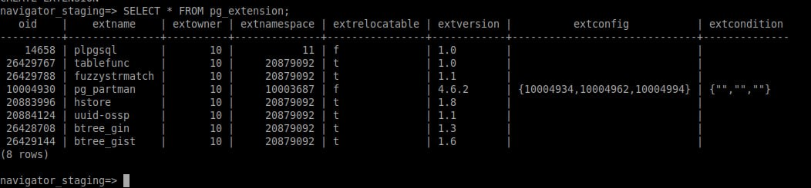

# Extension Installation Manual


### To enable additional functionality in PostgreSQL, the following extensions are required:

```sql
  CREATE EXTENSION btree_gin;
  CREATE EXTENSION btree_gist;
  CREATE EXTENSION hstore;
  CREATE EXTENSION tablefunc;
  CREATE EXTENSION "uuid-ossp";
  CREATE EXTENSION fuzzystrmatch;
  CREATE EXTENSION pg_trgm;
```

### These extensions provide various capabilities, such as additional indexes, semi-structured data handling, and UUID generation.



# Indices that must be created

## In table `troc.troc_employees`

#### To improve the performance of queries involving email searches, the following indexes have been created:

```sql
CREATE INDEX trgm_troc_email_idx ON troc.troc_employees USING gin (corporate_email gin_trgm_ops);
CREATE INDEX trgm_troc_old_email_idx ON troc.troc_employees USING gin (old_corporate_email gin_trgm_ops);
```

## In table `epson.users_raw`

## To optimize text search queries in the `email` column, the following index has been created:

```sql
CREATE INDEX trgm_user_idx ON epson.users_raw USING gin (email gin_trgm_ops);
```

### These indexes improve the speed of queries that involve text searches on the specified columns.