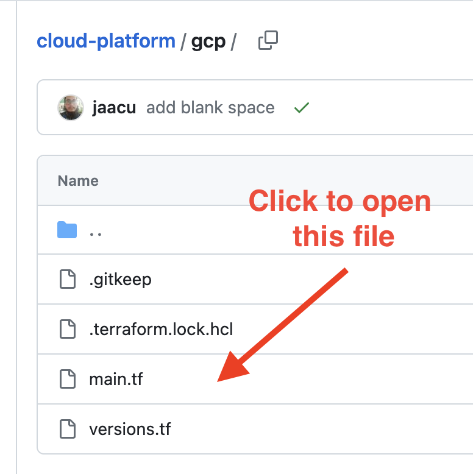
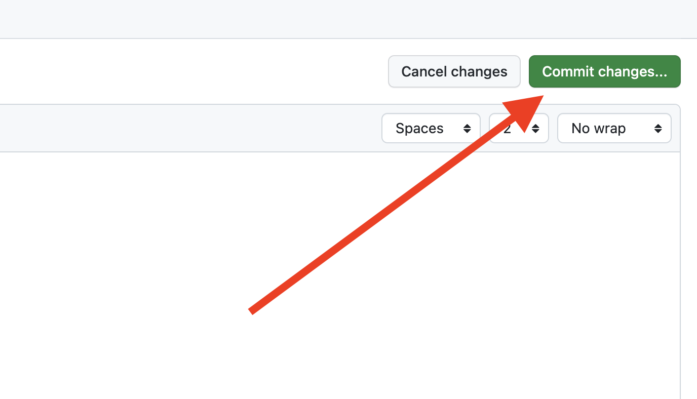
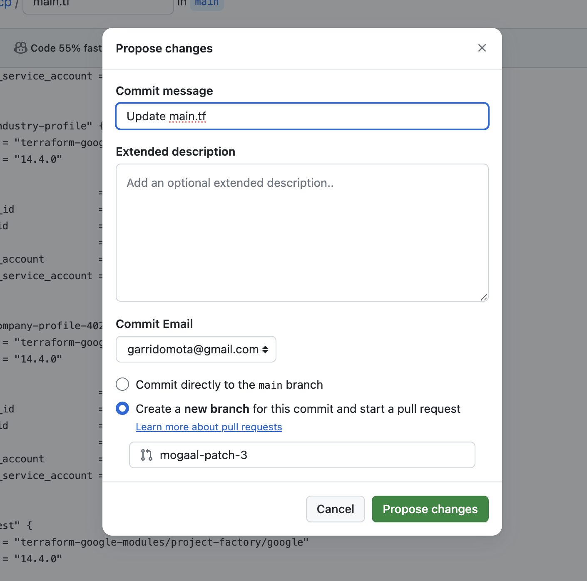
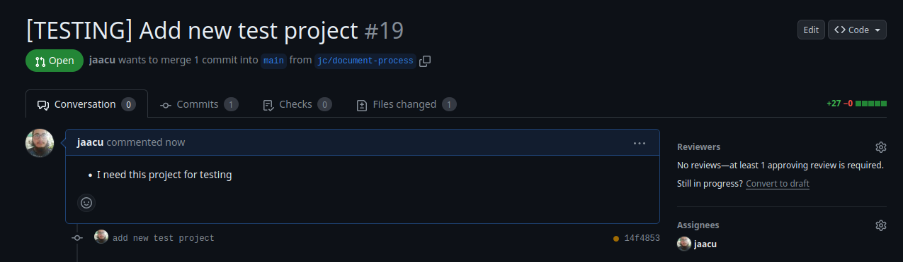
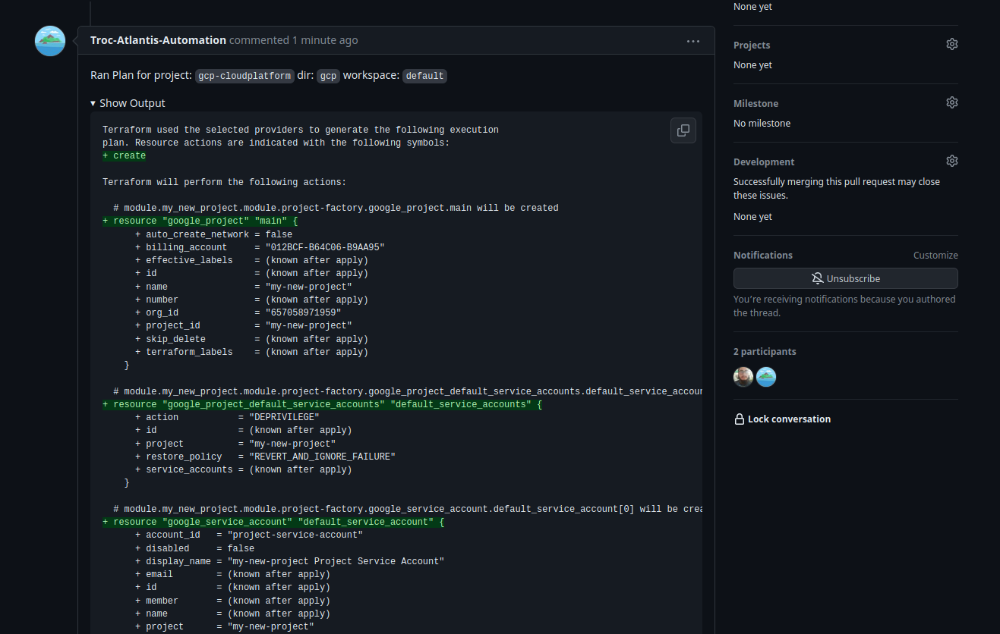
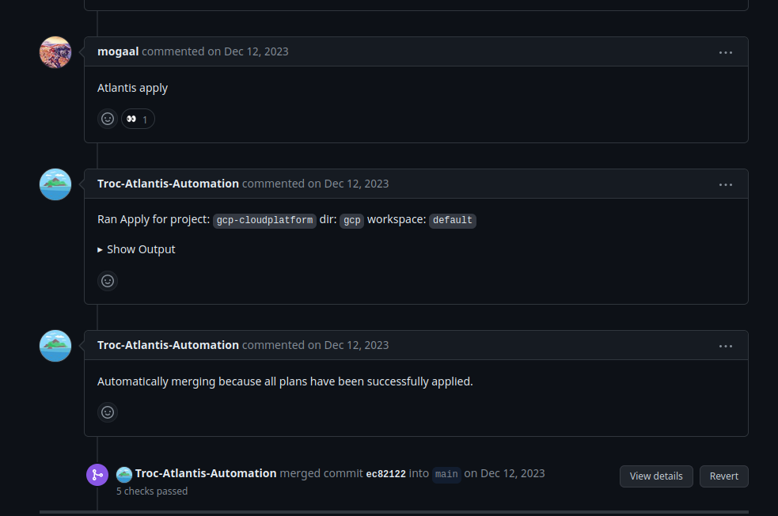

# Creating google projects on GPC

This guide provides the necessary information to create a new GCP project. The process consist in raise a change, ask for an approval from a platform member and creation is going to happens automatically. 

## Requirements

Before you begin, ensure you have access to the [cloud platform](https://github.com/Trocdigital/cloud-platform) repository. It is the only prerequisite. If you don't have access, please contact any member of the infrastructure team.

## Step 1: Open [cloud platform repo](https://github.com/Trocdigital/cloud-platform)

Go to Github and open the [cloud platform repo](https://github.com/Trocdigital/cloud-platform), everything can be done directly online, and there is no need to use the Git CLI at all.

<figure markdown="span">
  { width="500" }
  <figcaption>Open file</figcaption>
</figure>


## Step 2: Edit the `main.tf` file

1. Click on the pencil button to edit the file. 

<figure markdown="span">
  { width="500" }
  <figcaption>Edit file</figcaption>
</figure>


2. Go to the end of the file
3. Add your new google project block (See the example below)
4. Replace `my_new_project` and `my-new-project` with a descriptive project name
5. Adjust `activate_apis` apis with the GCP services you will need for this project. This is an example:

```tf
module "my_new_project" {
  source  = "terraform-google-modules/project-factory/google"
  version = "14.4.0"

  name                    = "my-new-project"
  org_id                  = local.organization_id
  billing_account         = local.billing_account
  default_service_account = "deprivilege"

  activate_apis = [
    "logging.googleapis.com",
    "monitoring.googleapis.com",
    "compute.googleapis.com",
    "dns.googleapis.com",
    "container.googleapis.com",
    "iamcredentials.googleapis.com",
    "cloudresourcemanager.googleapis.com",
    "iam.googleapis.com",
    "alloydb.googleapis.com",
    "artifactregistry.googleapis.com",
    "file.googleapis.com",
    "memcache.googleapis.com",
    "redis.googleapis.com",
    "servicenetworking.googleapis.com",
  ]
}
```

## Step 3: Commit the changes and and push a new branch

1. Commit the changes by pressing the *"Commit Changes"* button in the top right corner:

<figure markdown="span">
  { width="500" }
  <figcaption>commit changes</figcaption>
</figure>

2. Create a new branch by clicking the *"Propose new changes"* button.

<figure markdown="span">
  { width="500" }
  <figcaption>commit changes</figcaption>
</figure>


3. Add a title and a description explaining why you need a new project. The clearer your explanation, the quicker the team can approve it.

<figure markdown="span">
  { width="500" }
  <figcaption>PR created</figcaption>
</figure>

## Step 4: Ask for approval

The final step is to ask a member of the infrastructure/platform team for a quick review and approval.

------

# Steps for the Infrastructure Team

!!! note

    The entire process is completely automated by Atlantis; it will apply the changes
    without requiring any manual intervention from you, other than reviewing the PR.

1. **Review Atlantis output**: It is important to review the Atlantis output, including the objects to be created. Examine the file contents and the Atlantis comment with the Terraform output

<figure markdown="span">
  { width="500" }
  <figcaption>Atlantis comment with terraform output</figcaption>
</figure>

2. **Approve the PR and apply if everything looks good**: First, approve the PR on GitHub; second, run atlantis apply. After that atlantis will apply the changes and close the PR once everything is ready


<figure markdown="span">
  { width="500" }
  <figcaption>Atlantis applies and closes the PR</figcaption>
</figure>
