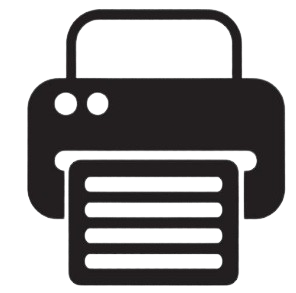

  Odoo Inventory 

## **🌟 Introduction**
Welcome to the company inventory system guide, we will explore how Odoo helps us keep everything organized and efficient.

## **📦 Product Management**
Our catalog at Odoo is extensive and detailed, ensuring that each product is right where it should be.

### **Main Categories**
- **Electronics**: From smartphones to latest generation gadgets.
- **Fashion**: Trend-setting clothing.
- **Accessories**: Perfect accessories for any occasion.

## **🔍 Stock Tracking**
Accurate tracking is vital. That's why we use cutting-edge technology to always know where each item is.

### **Serial numbers**
Ideal for unique items that require special attention.

### **Lots**
Perfect for handling large quantities of similar products.

## **🔄 Inventory Procedures**
Our procedures are designed to be clear and simple, facilitating daily inventory management.

### **Receptions**
We receive new products with a system that verifies and records each item upon arrival.

### **Deliveries**
Our commitment is to deliver on time, and our process is optimized for this.

### **Inventory tweaks**
When the numbers don't add up, our inventory adjustments kick in to fix it.

## **🏁 Conclusion**
With Odoo, the Company keeps its inventory under control, ensuring efficiency and accuracy every step of the way.

---
<button id="printButton">PRINT PDF   </button>
